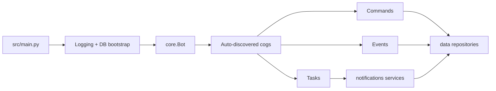

# Paul

Paul is a Discord bot for The United States Navy community in Sea of Thieves. It handles operational record-keeping and
Discord automation around sailor activity, including voyage participation, hosting history, awards, disciplinary notes,
and scheduled notifications.

The project is actively maintained and is still evolving. The documentation in this repository is aimed at developers
working on the bot itself.

## What Paul Does

- Records sailor activity and related administrative data in MySQL.
- Runs Discord slash/text commands through dynamically discovered cogs.
- Responds to Discord events and background task loops.
- Schedules and delivers automated notifications, including ship health summaries.

## Repository Overview

```text
src/
  main.py            Application entrypoint and startup bootstrap
  core/              Bot class and command cooldown wiring
  cogs/              Commands, events, and scheduled task cogs
  data/              SQLAlchemy models, engine, migrations, repositories
  notifications/     Notification scheduling, rendering, routing, delivery
  config/            Environment and server-specific constants
  utils/             Shared utilities used across commands and services
tests/               Unit and integration-style test coverage
docs/                Developer documentation
```

## Developer Docs

- [Getting Started](docs/getting_started.md)
- [Architecture](docs/architecture.md)
- [Naming Conventions](docs/naming_conventions.md)

## Running Paul

Paul currently starts from [`src/main.py`](src/main.py).

```bash
uv run src/main.py
```

That startup path:

1. Initializes logging.
2. Creates database tables from SQLAlchemy models.
3. Runs Alembic migrations.
4. Starts the Discord bot and loads all discovered cogs.

See [Getting Started](docs/getting_started.md) for the full local setup flow.

## Common Commands

```bash
uv sync --group dev --group lint
uv run src/main.py
uv run pytest tests
uvx ruff check .
uvx ruff format .
```

## High-Level Runtime View



## Notes

- The docs in this repository are developer-focused rather than an end-user command manual.
- Cogs are auto-discovered from `src.cogs`, so the runtime surface grows with the codebase instead of a hand-maintained
  extension list.
