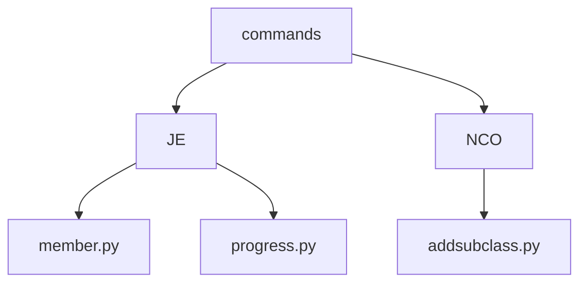
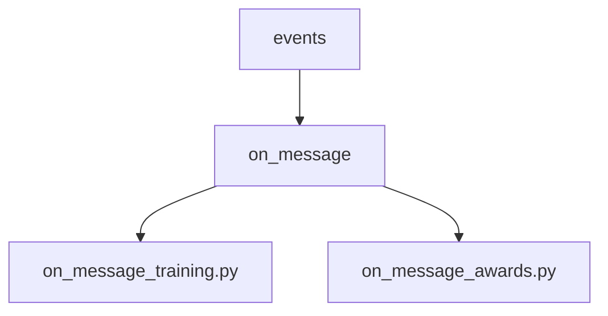
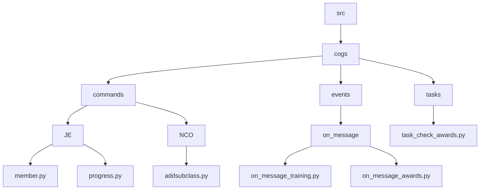

## Cogs

### 1. Commands
Commands are triggered by a user typing a command into the chat. This can be either slash commands  `/member` or a message command `!member`. 

The commands folder contain folder for each minimum rank level, and each folder may contain files for each command for that rank. 
An example is **JE** which contains commands for Junior Enlisted members or up. Rarely the command would be locked to only that rank.

### 2. Events
Events are triggered by discord events, such as a message being sent, a reaction being added, or a member joining the server. An example is **on_message_training.py** which triggers when a message is sent and checks if it is a training message.
And takes action accordingly.

So the event folder may contain a folder for each event, and each folder may contain files for each use case relevant to that event (Separation of concerns). 

> The name of the folder should always be the exact name of the event, according to discord py  specification.

### 3. Tasks
Finally, we have tasks, which are similar to events, but they run on a loop. They are useful for things like updating a status or sending a message every so often.  An example of a test is **task_check_awards.py** which runs every day and informs ship command channel of the awards that are due to be given out.

### File Structure
Below is a diagram of the file structure of the cogs folder.

This is an example, and the actual files/folders may differ.

| Folder | Triggered                               |
|--------|-----------------------------------------|
| commands | On a command/intercaction execution   |
| events | On an event                             |
| tasks  | Every x period                          |
