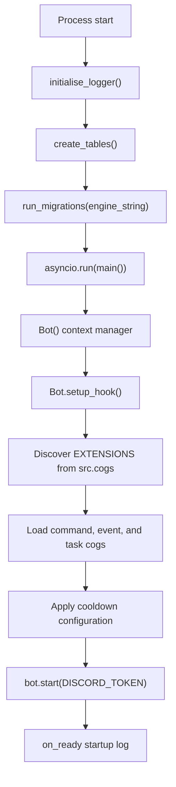
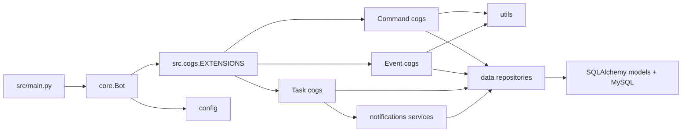
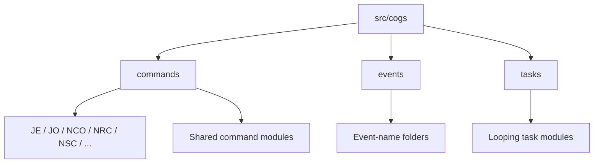
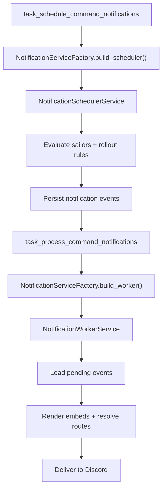

# Architecture

This document gives a developer-focused overview of how Paul is structured today. It is intentionally high level: the
goal is to show how the runtime is composed, where major responsibilities live, and how the main automation flows fit
together.

## Runtime Areas

| Area                 | Responsibility                                                                                |
|----------------------|-----------------------------------------------------------------------------------------------|
| `src/main.py`        | Process entrypoint, logger setup, table creation, migration run, and bot startup              |
| `src/core/`          | The `Bot` implementation, startup logging, extension loading, and cooldown wiring             |
| `src/cogs/`          | Discord-facing behavior split into commands, events, and scheduled tasks                      |
| `src/data/`          | SQLAlchemy engine, models, migrations, reports, and repository classes                        |
| `src/notifications/` | Notification definitions, scheduling, rendering, routing, delivery, and service composition   |
| `src/config/`        | Environment values, server constants, rollout settings, task timing, and requirements         |
| `src/utils/`         | Shared helpers for Discord behavior, embeds, logging, voyage processing, promotions, and more |

## Startup Flow

Paul starts in [`src/main.py`](/C:/Users/coenw/Documents/Code/USN/Paul/src/main.py). The process bootstraps the local
runtime before the Discord connection is opened.

```mermaid
flowchart TD
    A["Process start"] --> B["initialise_logger()"]
    B --> C["create_tables()"]
    C --> D["run_migrations(engine_string)"]
    D --> E["asyncio.run(main())"]
    E --> F["Bot() context manager"]
    F --> G["Bot.setup_hook()"]
    G --> H["Discover EXTENSIONS from src.cogs"]
    H --> I["Load command, event, and task cogs"]
    I --> J["Apply cooldown configuration"]
    J --> K["bot.start(DISCORD_TOKEN)"]
    K --> L["on_ready startup log"]
```

## Runtime Composition

At a high level, the bot runtime is centered around `core.Bot`, with Discord cogs providing the behavior surface and
repositories/services backing the business logic.

```mermaid
flowchart LR
    A["src/main.py"] --> B["core.Bot"]
    B --> C["src.cogs.EXTENSIONS"]
    C --> D["Command cogs"]
    C --> E["Event cogs"]
    C --> F["Task cogs"]
    D --> G["utils"]
    D --> H["data repositories"]
    E --> G
    E --> H
    F --> I["notifications services"]
    F --> H
    I --> H
    H --> J["SQLAlchemy models + MySQL"]
    B --> K["config"]
```

## Cogs and Extension Loading

The `src/cogs/__init__.py` module walks the `src/cogs` tree and builds `EXTENSIONS` automatically from every Python
module it finds. That means:

- new commands, events, or task modules are loaded by placement under `src/cogs`
- there is no hand-maintained extension registry to update
- the runtime shape follows the directory structure closely

The cogs are organized into three broad categories:

| Cog Type | Purpose                                                                         |
|----------|---------------------------------------------------------------------------------|
| Commands | User-invoked slash or text commands                                             |
| Events   | Handlers for Discord lifecycle/events such as message or member updates         |
| Tasks    | Background loops for periodic work such as notification scheduling and delivery |

The commands area is mostly organized by role or rank scope, with subfolders such as `JE`, `NCO`, `NRC`, and `NSC`, plus
the occasional top-level shared module.

```mermaid
flowchart TD
    A["src/cogs"] --> B["commands"]
    A --> C["events"]
    A --> D["tasks"]
    B --> E["JE / JO / NCO / NRC / NSC / ..."]
    B --> F["Shared command modules"]
    C --> G["Event-name folders"]
    D --> H["Looping task modules"]
```

## Notification Subsystem

The `src/notifications/` package is a service layer used mainly by scheduled task cogs and selected NSC command flows.
`NotificationServiceFactory` wires together the reusable parts of the subsystem:

- definition providers
- eligibility evaluators
- payload factories
- route resolution
- renderers
- delivery adapters
- repositories and rollout configuration

The current background notification flow looks like this:

```mermaid
flowchart TD
    A["task_schedule_command_notifications"] --> B["NotificationServiceFactory.build_scheduler()"]
    B --> C["NotificationSchedulerService"]
    C --> D["Evaluate sailors + rollout rules"]
    D --> E["Persist notification events"]
    E --> F["task_process_command_notifications"]
    F --> G["NotificationServiceFactory.build_worker()"]
    G --> H["NotificationWorkerService"]
    H --> I["Load pending events"]
    I --> J["Render embeds + resolve routes"]
    J --> K["Deliver to Discord"]
```

There is also a separate weekly ship-health path:

- `task_ship_health_summary.py` triggers on a scheduled weekday/time
- `NotificationServiceFactory.build_ship_health_summary_service()` creates the service
- the service loads summary data through `ShipHealthSummaryRepository`
- rendered summaries are delivered through the same Discord delivery abstractions

## Data Layer

The `src/data/` package contains the persistence boundary for the application:

- `engine.py` defines the SQLAlchemy engine using environment configuration
- `models.py` defines database models and table creation helpers
- `migrations/` contains Alembic migration wiring and version scripts
- `repository/` contains per-domain repositories used by commands, tasks, and services

This keeps Discord-facing code mostly focused on orchestration while repositories own database access patterns.

## Design Intent

Paul is organized around a few practical boundaries:

- Discord integration lives in `core/` and `cogs/`
- persistence logic lives in `data/`
- reusable automation behavior lives in `notifications/`
- constants and rollout switches live in `config/`
- cross-cutting helpers live in `utils/`

That separation is not perfect or final, but it makes the current codebase easier to extend without concentrating all
behavior in the bot class or command modules.
