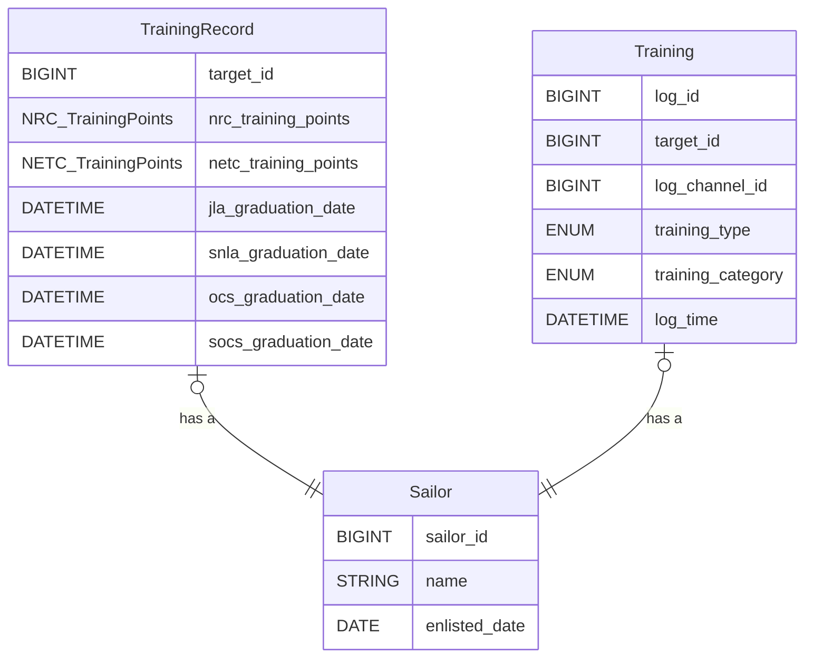
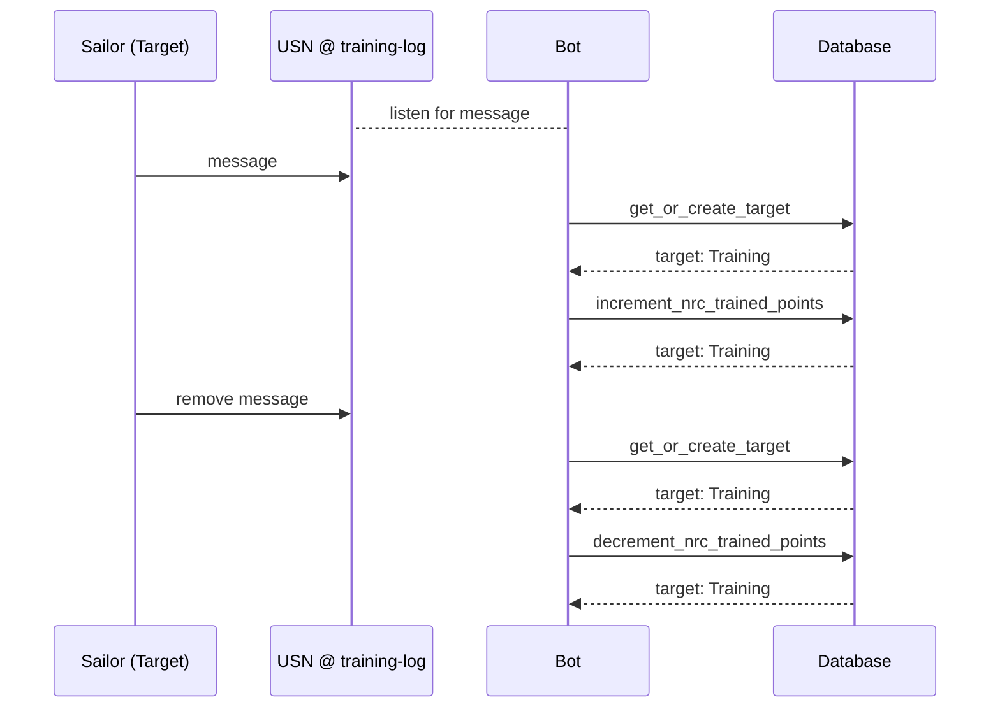
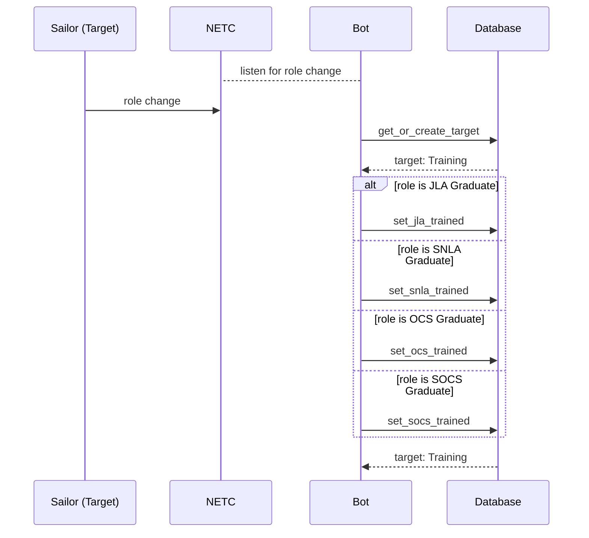

# Training
The following document outlines the requirements and design for the bots (PAUL's) training system. 
The training system is responsible for tracking the training points and completion of training for targets.

It is important to understand that these are 2 separate concepts

**1. Training Points** (Trainer)
> The points a user has earned for training others. This is used for example for rewards and commendations.

**2. Trained Completion** (Trainee)
> The completion of training for a user. This is used for example for eligibility for promotions.

# Files
Following is a list of files that are part of the training system. This excludes generic files like `config.py` and `models.py`.

| Filename                                        | Description                                                                   | Status |
|-------------------------------------------------|-------------------------------------------------------------------------------|--------|
| /data/repository/training_records_repository.py | The main database facade/repository for anything related to training records. | DONE   |
| /cogs/on_message_training.py                    | The on_message event listener for training points.                            | DONE   |
| /cogs/on_delete_training.py                     | The on_delete event listener for training points.                             | DONE   |
| /cogs/on_member_update_training.py              | The on_member_update event listener for trained completion.                   | TODO   |
| /cogs/populate_training_records.py              | The populate_training_records command.                                        | DONE   |
| /utils/training_utils.py                        | The utility functions for training records                                    | DONE   |

# Abbreviations
The following abbreviations are used in this document:
- USN: United States Navy of SOT
- NRC: New Recruit Command
- NETC: Naval Education and Training Command
- JLA: Junior Leadership Academy
- SNLA: Senior non-commissioned officer
- OCS: Officer Candidate School
- SOCS: Senior Officer Candidate School

# Considerations
There should be someway for a user to check their training points. 
So they know if everything is being added correctly. And they can alert us if something is wrong.

# Datamodel: training_records
| Field                 | Description                                                                                            | Type     | Optional | Default | Context |
|-----------------------|--------------------------------------------------------------------------------------------------------|----------|----------|---------|---------|
| target_id (`PK`/`FK`) | The discord ID of the target                                                                           | BIGINT   | FALSE    |         |         |
| NRC_training_points   | The number of New Recruit Command (NRC) trained points                                                 | INT      | FALSE    | 0       | Trainer |
| NETC_training_points  | The number of Naval Education and Training Command (NETC) trained points                               | INT      | FALSE    | 0       | Trainer |
| JLA_graduation_date   | The date of when the target was trained Junior Leadership Academy (JLA). None if not trained           | DATETIME | TRUE     | None    | Trainee |
| SNLA_graduation_date  | The date of when the target was trained as Senior non-commissioned officer (SNLA). None if not trained | DATETIME | TRUE     | None    | Trainee |
| OCS_graduation_date   | The date of when the target was trained as Officer Candidate School (OCS). None if not trained         | DATETIME | TRUE     | None    | Trainee |
| SOCS_graduation_date  | The date of when the target was trained as Senior Officer Candidate School (SOCS). None if not trained | DATETIME | TRUE     | None    | Trainee |
## training
| Field             | Description                                                            | Type     | Optional | Default | Context |
|-------------------|------------------------------------------------------------------------|----------|----------|---------|---------|
| log_id (`PK`)     | The unique ID of the log entry                                         | BIGINT   | FALSE    |         |         |
| target_id (`FK`)  | The discord ID of the target                                           | BIGINT   | FALSE    |         |         |
| log_channel_id    | The discord ID of the channel where the log entry was made             | BIGINT   | FALSE    |         |         |
| training_type     | The type of training that was logged (NRC, NETC, JLA, SNLA, OCS, SOCS) | ENUM     | FALSE    |         |         |
| training_category | The category of training that was logged (NRC, NETC)                   | ENUM     | FALSE    |         |         |
| log_time          | The time of the log entry                                              | DATETIME | FALSE    |         |         |

# Adding training points
To add training points to a target, the bot will watch for message in certain channels. When a message is detected, the bot will add training points to the target. 

We have 2 type of points to worry about 

| Type | Description                                                                                                                                                 |
|------|-------------------------------------------------------------------------------------------------------------------------------------------------------------|
| NRC  | New Recruit Command (NRC) training points. This is the basic training given for training new recruits.                                                      |
| NETC | Naval Education and Training Command (NETC) training points. This is the advanced training given. This may include several categories of training.          |

# Adding trained completion
To add trained completion to a target, the bot will watch for role changes. When a role change is detected in the NETC server, the bot will add trained completion to the target. 
